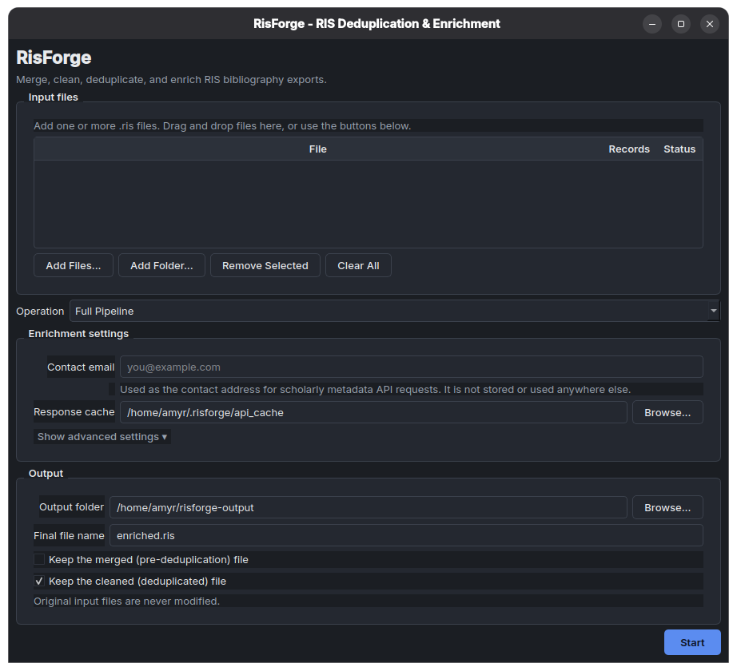

<h1 align="center">risforge</h1>

<p align="center">
  <strong>Clean, deduplicate, and enrich RIS bibliographic files for systematic reviews.</strong>
</p>

`risforge` transforms messy, overlapping `.ris` exports from Scopus, PubMed, Web of Science, or EndNote into a single, clean, and metadata-rich file ready for screening.
<p align="center">
  
</p>

## How it works

| Stage | What it does | What it doesn't do |
| :--- | :--- | :--- |
| **Merge** | Combines multiple `.ris` files into one. | Decide if records are duplicates. |
| **Clean** | Deduplicates via DOI and fuzzy title/author matching. Zero data loss. | Fetch new data from the internet. |
| **Enrich** | Fills missing metadata (abstracts, PDFs, keywords) via Crossref, OpenAlex, Semantic Scholar, and Unpaywall. | Overwrite your existing data. |

## Features

- **Smart Deduplication**: DOI-first clustering with a normalized title + first-author fallback.
- **Zero Data Loss**: Merges duplicate clusters by keeping the most complete record and appending missing fields from others.
- **Non-Destructive Enrichment**: Only fills empty fields; existing metadata is never overwritten.
- **Resilient HTTP**: Automatic retries, exponential backoff, and a 7-day on-disk cache.
- **Flexible Interfaces**: Use it as a Python library, a CLI tool, or a cross-platform desktop GUI.

## Installation

Requires Python 3.10+.

```bash
# Core library and CLI
pip install risforge

# With the optional desktop GUI
pip install "risforge[gui]"
```

## Quick Start

### Desktop GUI

Launch the graphical interface for a drag-and-drop workflow:

```bash
risforge-gui
```

### Command Line

Run the full pipeline (merge, clean, and enrich) in a single command:

```bash
risforge pipeline scopus.ris pubmed.ris wos.ris \
    --email you@example.com \
    --output final.ris
```

*Note: An email is required for API "polite pool" access. It is only sent in request headers and never stored.*

Run individual steps if you need to inspect intermediate files:

```bash
risforge merge scopus.ris pubmed.ris wos.ris merged.ris
risforge clean merged.ris clean.ris
risforge enrich clean.ris enriched.ris --email you@example.com
```

### Python API

```python
from risforge import risforge

# Automatically merges multiple files, cleans, and enriches
result = risforge(
    input_paths=["scopus.ris", "pubmed.ris", "wos.ris"],
    dedup_path="clean.ris",
    enriched_path="enriched.ris",
    email="you@example.com",
)

print(f"Merged: {result.merged_record_count}")
print(f"Unique: {result.cleaned_record_count}")
print(f"Enriched: {result.enrichment_stats['enriched']}")
```

## Good to Know

- **Unresolved DOIs**: Records without a DOI that fail title-matching are left unmodified and logged to `failed_records.json`.
- **Merge vs. Clean**: `merge` simply concatenates files. Run `clean` afterward to actually collapse duplicates.
- **Caching**: API responses are cached for 7 days. Re-running the pipeline on the same data is nearly instant.

## Contributing

1. Clone and install dev dependencies: `pip install -e ".[dev,gui]"`
2. Run tests: `pytest`
3. Open a PR. Please include tests for behavioral changes and update `CHANGELOG.md`. Predictability is a core feature; silent behavior changes are treated as bugs.

## License

MIT — see [LICENSE](LICENSE).
